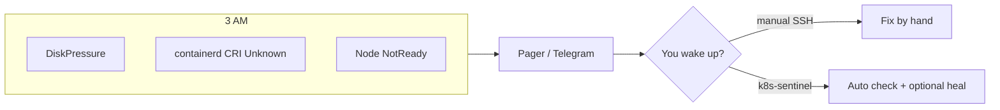
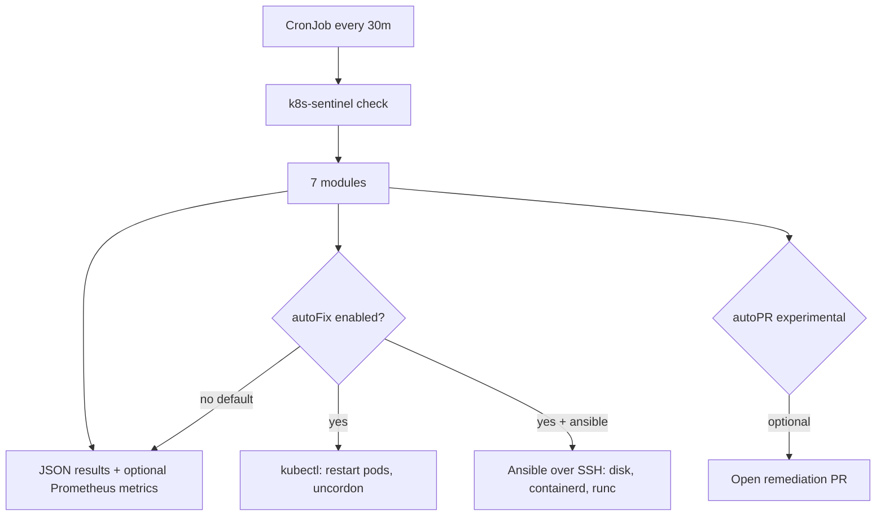
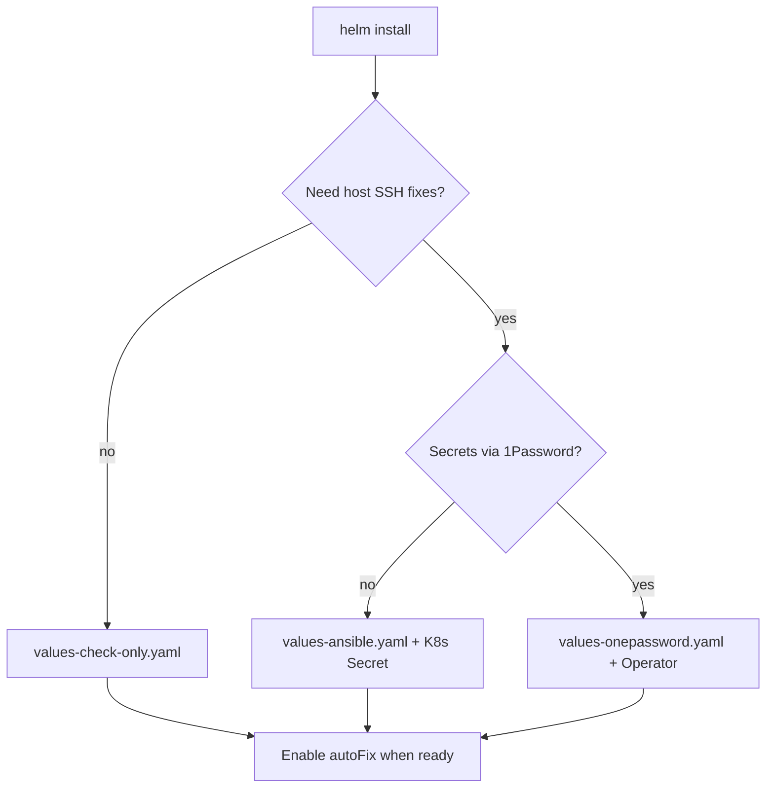

# k8s-sentinel

**Self-hosted Kubernetes health checks and optional auto-healing for bare-metal and homelab clusters.**

[](https://github.com/dejavux/k8s-sentinel/actions/workflows/ci.yml)
[](https://github.com/dejavux/k8s-sentinel/releases)
[](LICENSE)
[](https://github.com/dejavux/k8s-sentinel/pkgs/container/k8s-sentinel)

**Product overview** → [dejavux.github.io/k8s-sentinel](https://dejavux.github.io/k8s-sentinel/) · [docs/PRODUCT.md](docs/PRODUCT.md)

k8s-sentinel runs as a **CronJob** every 30 minutes. It catches disk pressure, containerd CRI drift, kube-proxy issues, and abnormal pods — then optionally heals via **kubectl** or **Ansible over SSH**.

> **Safe defaults**: `autoFix=false`, `autoPR=false`. Install check-only first; enable fixes after review.

---

## The problem



Managed EKS/GKE tools rarely fix **host-level** issues. Homelab and bare-metal clusters need something lightweight that speaks both **Kubernetes API** and **SSH**.

---

## How it works



| Layer | What it does |
|-------|----------------|
| **Checks** | Python module registry (`runc`, `disk`, `containerd`, `kubelet`, `pods`, `components`, `resources`) |
| **Cluster fix** | Restart system pods, delete succeeded jobs, uncordon nodes |
| **Host fix** | Bundled Ansible playbooks via SSH (bare-metal IP inventory) |
| **Observability** | Optional Prometheus text exposition + Pushgateway |

---

## Who is it for?

| You are… | Why k8s-sentinel |
|----------|------------------|
| **Homelab K8s** | One Helm install; no SaaS bill |
| **Bare-metal + SSH** | Fixes containerd/disk where cloud agents cannot |
| **1–3 person ops** | CronJob + optional autoFix beats waking up for disk full |
| **Not** pure managed cloud | No SSH → host modules won't help |

---

## Quick start (check-only)

```bash
helm upgrade --install k8s-sentinel oci://ghcr.io/dejavux/charts/k8s-sentinel \
  --version 0.2.7 \
  -n kube-system
```

From this repo:

```bash
helm upgrade --install k8s-sentinel ./charts/k8s-sentinel \
  -n kube-system \
  -f examples/helm/values-check-only.yaml
```

Manual run:

```bash
kubectl create job --from=cronjob/k8s-sentinel sentinel-check-$(date +%s) -n kube-system
kubectl logs -n kube-system -l job-name=sentinel-check-$(date +%s) -f
```

**Next steps**: [INSTALL_HELM.md](docs/INSTALL_HELM.md) · Ansible SSH · [1Password overlay](manifests/overlays/onepassword/) · [full product page](https://dejavux.github.io/k8s-sentinel/)

---

## Install paths



---

## Modules

| Module | Checks | Auto-fix (when enabled) |
|--------|--------|-------------------------|
| `runc` | runc availability | Ansible |
| `disk` | DiskPressure, rootfs usage | Ansible + optional CI prune |
| `containerd` | CRI Unknown, NodeStatusUnknown | fix-containerd-cri playbook |
| `kubelet` | NotReady nodes | uncordon / systemctl |
| `pods` | CrashLoop, Pending, etc. | Pod restart + optional GitOps PR |
| `components` | kube-proxy, CoreDNS | Pod restart |
| `resources` | Memory/PID pressure, `kubectl top` | Alert only |

---

## Safe defaults vs production

| Setting | Public default | Production (your choice) |
|---------|----------------|--------------------------|
| `config.autoFix` | `false` | `true` after review |
| `config.autoPR` | `false` | experimental GitOps |
| `ansible.enabled` | `false` | `true` for bare-metal |
| `ansible.hostNetwork` | `false` | often `true` for LAN SSH |

---

## Configuration

| Env / values | Description | Default |
|--------------|-------------|---------|
| `config.modules` | Comma-separated modules | all 7 |
| `config.autoFix` | Apply repairs | `false` |
| `config.autoPR` | Open GitOps PR on failure | `false` |
| `ansible.enabled` | Mount inventory + SSH | `false` |
| `gitops.githubRepo` | Target repo for PRs | `""` |
| `SENTINEL_GITHUB_REPO` | GitOps clone target | required when GitOps on |

---

## Development

```bash
make test          # pytest
make lint-ci       # ruff
npm ci             # GitOps TypeScript deps
```

---

## Releases

Tag `v*` → [release workflow](.github/workflows/release.yml):

- Image: `ghcr.io/dejavux/k8s-sentinel:<tag>`
- Chart: GitHub Release `.tgz`

---

## Documentation

| Doc | Purpose |
|-----|---------|
| [Product one-pager](https://dejavux.github.io/k8s-sentinel/) | Visual overview (GitHub Pages) |
| [PRODUCT.md](docs/PRODUCT.md) | Same content in Markdown |
| [INSTALL_HELM.md](docs/INSTALL_HELM.md) | Install guide |
| [SECURITY.md](SECURITY.md) | Vulnerability reporting |
| [CONTRIBUTING.md](CONTRIBUTING.md) | How to contribute |
| [CHANGELOG.md](CHANGELOG.md) | Release notes |

Private cluster overlays: [examples/private-cluster/](examples/private-cluster/README.md).

---

## License

Apache-2.0 — see [LICENSE](LICENSE).
