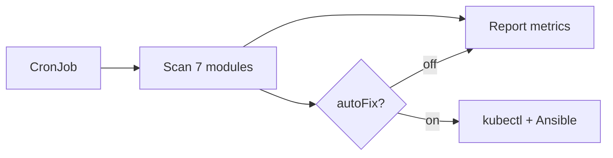
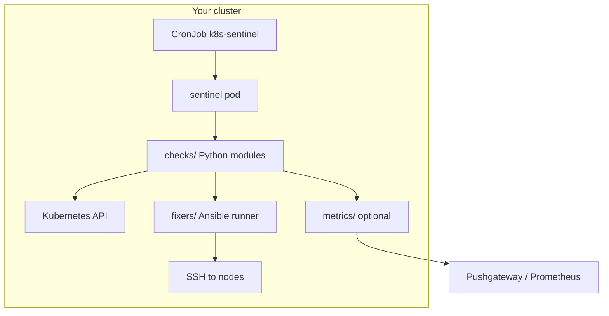

# k8s-sentinel — Product overview

> **Live page**: [dejavux.github.io/k8s-sentinel](https://dejavux.github.io/k8s-sentinel/)

**One-line pitch**

A lightweight Kubernetes CronJob that heals your self-hosted cluster before you wake up — disk pressure, containerd CRI, kube-proxy, and more — with optional Ansible SSH fixes for bare-metal nodes.

---

## The problem

Self-hosted Kubernetes breaks in predictable ways:

| Symptom | Typical cause | Cloud SaaS gap |
|---------|---------------|----------------|
| Nodes `NotReady` at 3 AM | disk full, containerd CRI drift | Rarely SSHs into your metal |
| `CrashLoopBackOff` system pods | kube-proxy, CoreDNS | Alerts only |
| Silent disk creep | CI cache, logs, images | No host-level cleanup |

You already have Prometheus alerts. **k8s-sentinel is the optional heal layer** — not a Datadog replacement.

---

## The solution



- **Install in minutes** — single Helm release, check-only by default
- **Bare-metal aware** — Ansible over SSH when the API is not enough
- **Ops-friendly** — JSON results, optional Prometheus text metrics
- **Safe rollout** — enable `autoFix` only after you trust the checks

---

## Architecture



**Bundled in the image**: check modules, `fix-containerd-cri` playbook, optional GitOps PR worker (experimental).

**You provide**: kubeconfig RBAC (in-cluster), optional inventory ConfigMap + SSH key, optional secrets (K8s Secret or 1Password Operator).

---

## Modules at a glance

| Module | What it watches | Can auto-fix |
|--------|-----------------|--------------|
| `disk` | DiskPressure, root filesystem | ✅ Ansible |
| `containerd` | CRI plugin / Unknown state | ✅ Playbook |
| `runc` | Missing or broken runc | ✅ Ansible |
| `kubelet` | NotReady, scheduling | ✅ uncordon |
| `components` | kube-proxy, CoreDNS | ✅ pod restart |
| `pods` | CrashLoop, stuck Pending | ✅ restart (+ optional PR) |
| `resources` | Memory/PID pressure | ❌ alert only |

---

## Who should use it

| ✅ Good fit | ❌ Poor fit |
|------------|------------|
| Homelab K8s (k3s, kubeadm, Talos+SSH) | Pure EKS/GKE with no SSH |
| Bare-metal or Proxmox VMs as nodes | Large teams with full SRE platforms |
| 1–3 person ops, self-hosted monitoring | Need vendor SLA / enterprise support |

---

## Get started

**1. Check-only (recommended first)**

```bash
helm upgrade --install k8s-sentinel oci://ghcr.io/dejavux/charts/k8s-sentinel \
  --version 0.2.7 \
  -n kube-system
```

**2. Trigger a run**

```bash
kubectl create job --from=cronjob/k8s-sentinel sentinel-check-$(date +%s) -n kube-system
kubectl logs -n kube-system -l app.kubernetes.io/name=k8s-sentinel --tail=100
```

**3. Enable fixes (when ready)**

```bash
helm upgrade k8s-sentinel oci://ghcr.io/dejavux/charts/k8s-sentinel \
  --version 0.2.7 \
  -n kube-system \
  -f examples/helm/values-ansible.yaml \
  --set config.autoFix=true \
  --set ansible.remoteUser=YOUR_USER
```

Full guide: [INSTALL_HELM.md](./INSTALL_HELM.md)

---

## Production proof

Battle-tested on a **14-node bare-metal homelab** (Proxmox + kubeadm):

- CronJob every 30 minutes, 7 modules
- Prometheus + Grafana dashboard
- Telegram alert chain for failures
- Optional Ansible host repair over LAN SSH

*Numbers are from a private deployment; your mileage varies.*

---

## Compare

| | k8s-sentinel | Robusta / Komodor | DIY scripts |
|--|--------------|-------------------|-------------|
| Self-hosted | ✅ | ❌ SaaS | ✅ |
| Host SSH repair | ✅ Ansible | ❌ | manual |
| Install complexity | Helm chart | Agent + cloud | high |
| Cost | free (OSS) | $$ | time |

---

## Links

| Resource | URL |
|----------|-----|
| GitHub | [github.com/dejavux/k8s-sentinel](https://github.com/dejavux/k8s-sentinel) |
| Releases | [v0.2.7](https://github.com/dejavux/k8s-sentinel/releases/tag/v0.2.7) |
| Container | `ghcr.io/dejavux/k8s-sentinel:v0.2.7` |
| Issues / ideas | [GitHub Issues](https://github.com/dejavux/k8s-sentinel/issues) |
| Security | [SECURITY.md](../SECURITY.md) |

---

## License

Apache-2.0
